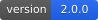
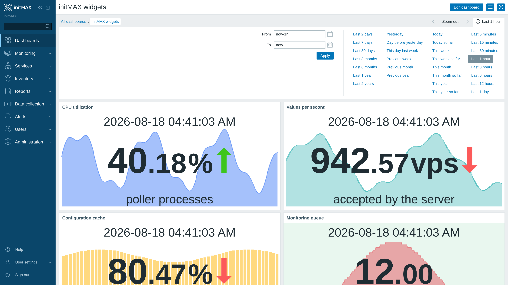
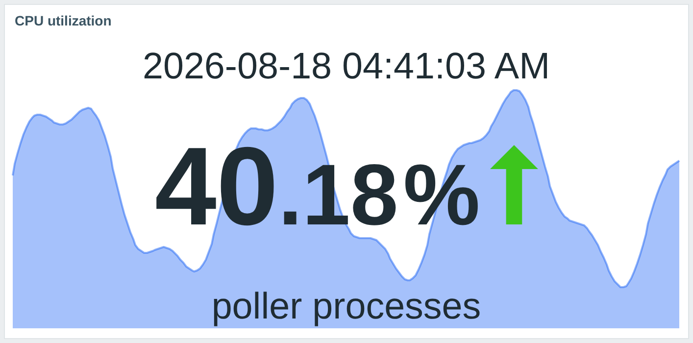
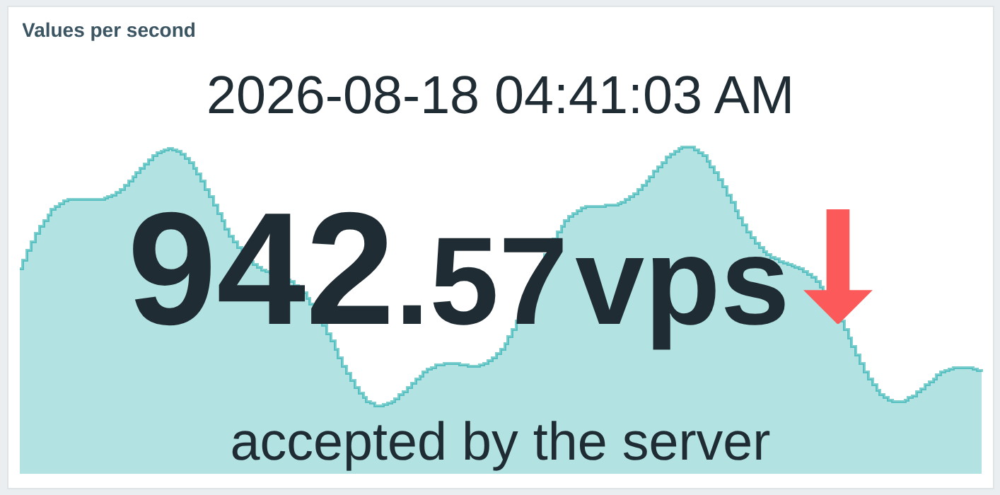
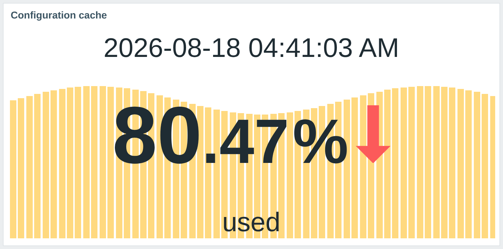
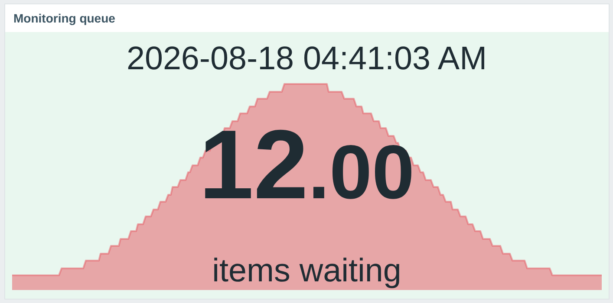
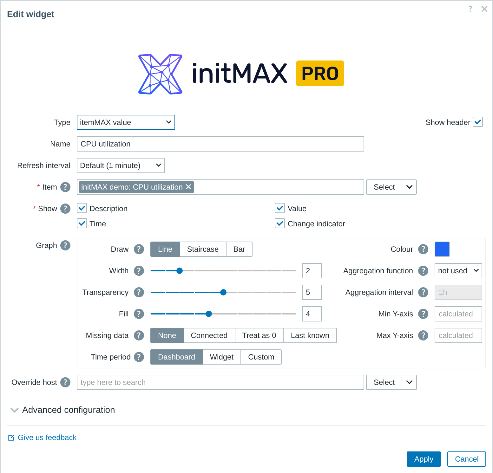
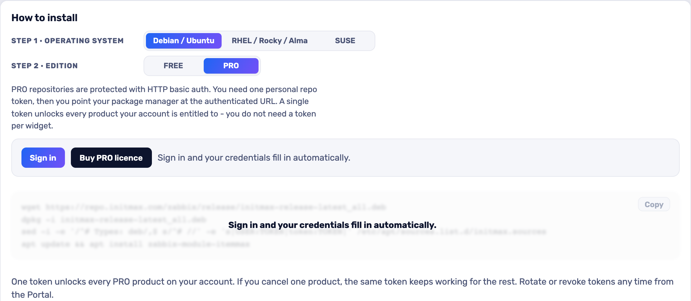

<h1>itemMAX</h1>

developed and maintained by

and community

<strong>The Zabbix item value panel, with the item's own history drawn behind the number.</strong> 
One tile answers both questions an operator actually asks - what is the value right now, and is that normal - without spending a second widget on the graph.

<a href="#what-you-can-build"><strong>Features</strong></a> &nbsp;·&nbsp;
<a href="#examples"><strong>Examples</strong></a> &nbsp;·&nbsp;
<a href="#install"><strong>Install</strong></a> &nbsp;·&nbsp;
<a href="#free-vs-pro"><strong>FREE vs PRO</strong></a> &nbsp;·&nbsp;
<a href="https://portal.initmax.com"><strong>Portal</strong></a> &nbsp;·&nbsp;
<a href="https://www.initmax.com/wiki/itemmax/"><strong>Docs</strong></a>

 

---

## Why itemMAX

A number on its own is not an answer. 31% is fine if the last four hours were 30%, and it is a story if they were 80%. **itemMAX** puts the item's own history straight behind the value, so the tile carries the reading, the direction and the recent shape at once - and a dashboard that used to need a value widget plus a graph widget now needs one.

## What you can build

<table>
<tr>
<td width="50%" valign="top">

**Headline metrics**
The number an operator looks at first, with its recent shape behind it.

</td>
<td width="50%" valign="top">

**Health tiles**
Thresholds repaint the whole tile, so a wall of widgets reads green-amber-red from across the room.

</td>
</tr>
<tr>
<td width="50%" valign="top">

**Capacity panels**
Trends data and a longer window turn the same tile into a capacity view.

</td>
<td width="50%" valign="top">

**Per-host boards**
Follow the dashboard host selector and one board serves every host.

</td>
</tr>
<tr>
<td width="50%" valign="top">

**Styled background graphs** &nbsp;PRO
Line, staircase or bars, in your colour, width, fill and transparency.

</td>
<td width="50%" valign="top">

**Aggregated views** &nbsp;PRO
Average, min, max, sum or count over an interval you choose, on its own time period.

</td>
</tr>
</table>

## Examples

<table>
<tr>
<td width="50%" align="center" valign="top"> <small><b>Cpu</b> - CPU utilization is immediately readable while the background history reveals spikes and longer-term movement.</small></td>
<td width="50%" align="center" valign="top"> <small><b>Vps</b> - A compact VPS overview keeps the most important value prominent without losing the surrounding trend.</small></td>
</tr>
<tr>
<td width="50%" align="center" valign="top"> <small><b>Cache</b> - Cache health and its recent history stay visible together, so a change is easy to recognize.</small></td>
<td width="50%" align="center" valign="top"> <small><b>Queue</b> - Queue depth is presented as an actionable dashboard signal rather than an isolated number.</small></td>
</tr>
</table>

## Configuration

One familiar widget form. Pick the item, choose what the tile shows - description, value, time, change indicator - and set units, decimals and per-element font sizes under **Advanced configuration**. The background graph is always drawn; PRO adds the controls over how it looks and what data it covers. PRO-only fields stay visible in FREE, greyed with a padlock, so you can see what an upgrade adds before you buy it.

## Install

Both **FREE** and **PRO** ship as **GPG-signed `deb` / `rpm` packages** from the initMAX repository - `apt` / `dnf` installs them and keeps them updated. Same flow for both editions; PRO just adds your personal repo token.

### Easiest way - the guided installer on the Portal

Open the product page, pick your **OS** and **edition**, and copy the ready-made command. FREE is fully public (no login); PRO fills in your token once you sign in. There's a feedback box right there too.

<a href="https://portal.initmax.com/catalog/zabbix-itemmax#how-to-install"><strong>→ Open the installer on the Portal</strong></a>

Prefer a plain archive? Every release also ships as a **ZIP** - FREE [straight from the repo](https://repo.initmax.com/zabbix/free/zip/itemmax/), PRO with your repo token - handy for offline or manual installs.

The module is enabled automatically during the package installation - verify it in **Administration → General → Modules**. Done.

## FREE vs PRO

The FREE edition still draws the graph - it simply draws it with the built-in presentation. The PRO controls are stripped from the FREE package rather than switched off, so the lock holds on the server, not only in the browser.

| Feature | FREE | PRO |
| ---------------------------------------------------------- | :----: | :----: |
| Item value with description, time and change indicator | ✅ | ✅ |
| Item history drawn as a background graph | ✅ | ✅ |
| Units, decimal places and per-element font sizes | ✅ | ✅ |
| Thresholds with colour palette | ✅ | ✅ |
| History / trends data source and value aggregation | ✅ | ✅ |
| Host override (dashboard-wide host selector) | ✅ | ✅ |
| One package for Zabbix 6.0 - 7.4 | ✅ | ✅ |
| Localised into all 25 Zabbix display languages | ✅ | ✅ |
| High availability ready | ✅ | ✅ |
| **Line, staircase and bar draw styles** | ❌ | ✅ |
| **Graph colour, width, fill and transparency** | ❌ | ✅ |
| **Aggregation function and interval (avg, min, max, sum, count, first, last)** | ❌ | ✅ |
| **Missing-data handling** | ❌ | ✅ |
| **Min / max Y-axis and a graph-specific time period** | ❌ | ✅ |
| Licence | AGPLv3 | [Commercial](./LICENSE-PRO.md) |

## Requirements

|              |                                                              |
| ------------ | ------------------------------------------------------------ |
| **Zabbix**   | 6.0 · 6.2 · 6.4 · 7.0 · 7.2 · 7.4 - one package covers all    |
| **PHP**      | 7.4 or newer                                                 |
| **OS**       | Debian/Ubuntu · RHEL/Rocky/Alma/Oracle/Amazon · SUSE         |
| **Editions** | FREE (public repo) · PRO (token-gated repo)                  |
| **Languages** | All 25 Zabbix display languages - the widget follows each user's own language setting |
| **High availability** | Ready. No server-side component and no local state; install it on every frontend node of an HA cluster and any node can serve it |

Every capability above works on every supported version. Thresholds arrived in Zabbix 6.4 and value aggregation in 7.0; on the older lines the widget supplies them itself rather than hiding them, so a 6.0 dashboard behaves exactly like a 7.4 one.

## Support &amp; links

- **[Documentation / Wiki](https://www.initmax.com/wiki/itemmax/)**
- **[Product page](https://www.initmax.com/product/itemmax/)**
- **[Portal](https://portal.initmax.com)** - downloads, tokens, support tickets
- **Source code (FREE, AGPLv3)** - included in every package and published as a [source archive](https://repo.initmax.com/zabbix/free/zip/itemmax/) on repo.initmax.com
- **[support@initmax.com](mailto:support@initmax.com)**

---

FREE: <a href="https://www.gnu.org/licenses/agpl-3.0.html">AGPLv3</a> &nbsp;·&nbsp; PRO: <a href="./LICENSE-PRO.md">commercial</a> &nbsp;·&nbsp; © 2021–2026 initMAX s.r.o.

